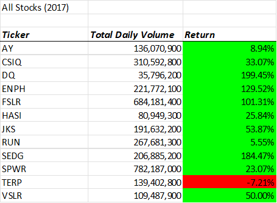
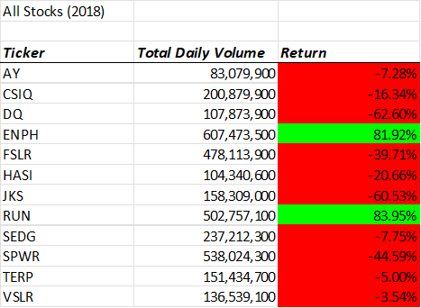
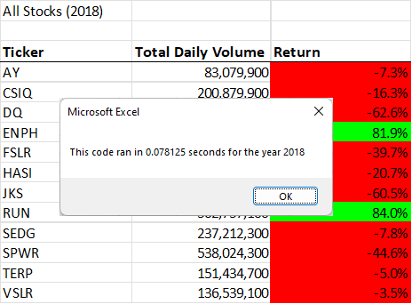
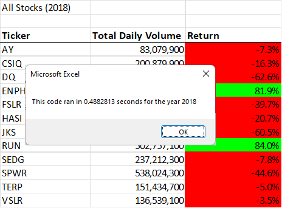

# Refactoring with Excel

## Overview of Project
  Steve appreciates our effort and success in creating 
a button that he can use to analyze an entire dataset, but would now like 
to expand his research for his parents and analyze the entire stock market
over the past few years. The code we have created works well for a dozen stocks or so,
but, we'd like to avoid the possibilty of it taking a long time to execute
when he starts to analyze all stocks in the market from previous years.

What was our solution? It was to refactor the current code that we have. Refactoring code does
not change the functionality; it makes it more efficient. We're looking
to see if we can execute code with fewer steps, less memory, or just improving the logic
of the code. 

As you read further, you'll see how we were able to accomplish this for Steve.

## Results

### Original Code Results
What you see below are the results of successful code doing it's job. We can also see that 2017 
yielded better results in stock market than 2018 did but that's beside the point. What we're trying 
to show here is that the code works; especially for just something this small. What we ended up doing is improving
the code for bigger data; which you will see further in this analysis.

     

### Refactored Code Results
Althought we don't have bigger data to truley test how much our refactored code can handle, we do 
have other ways to test this. Below, you will see how long it took for the code to complete. The refactored 
code was hundreths of seconds faster than the original code. Honestly, these images don't do it justice
but believe me, if you are going to do a bigger database, then the refactored code is the one you will want to go with.

     
 

## Summary
**1. What are the advantages or disadvantages of refactoring code?** 

I would say the advantages of refactoring code is exactly as I stated before. We improved the code to run faster and handle bigger data; but
I would like to also add that disadvantages will also present itself depending on the problem/situation. For example, if the code was bigger, we could've ran
into issues with new bugs and/or having to re-write certain parts of code because of this. All this comes at a price too, which is time and money.

**2. How do these pros and cons apply to refactoring the original VBA script?**

As you can see from the examples above, faster applies to our refactored code and althought we can show it here, it will run smoothly with bigger data sets.
As for the cons, it took us "google searching" and revisiting notes from previous classes to get all this to work. We ran into multiple errors which used up a lot
of time to figure out solutions for it, but hey we got the job done. Recognize the problem, address it, and solve it. 

